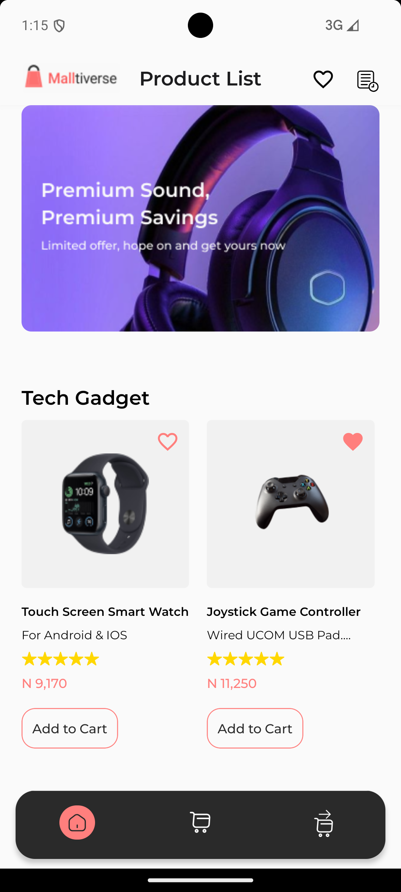
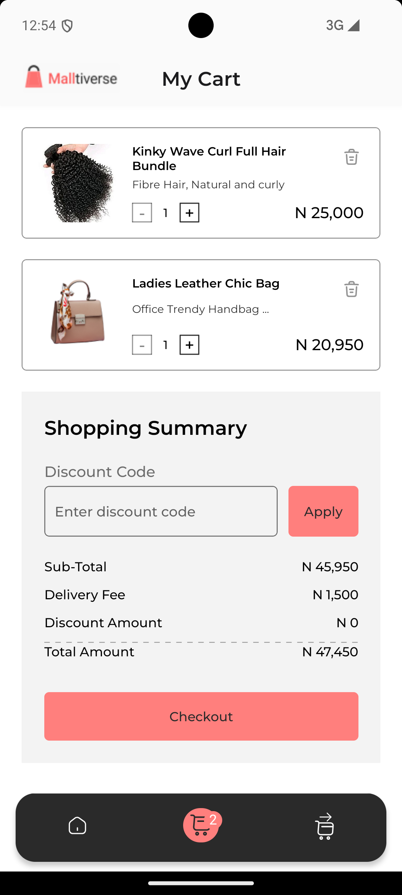

# Malltiverse App

Products Retail app uses Timbu.cloud api to fetch products and show relevant information of the products added.

  
  
  
  
  

## Features

- Fetch a list of products
- Add to Cart
- Checkout
- Make Payment
- Payment Success Display

## Demo

- Try out the app on Appetize.io: [Multiverse Demo]([https://appetize.io](https://appetize.io/app/b_shlbqjo26ofmobtkck7usazvxm))

- Download apk build: [ProductsRetailApk](https://expo.dev/accounts/tommzydanz/projects/Malltiverse/builds/444a513e-6752-4c1b-85fc-14fb89de1a48) link expires in 13days

## Getting Started

These instructions will help you set up the project on your local machine for development and testing purposes.

### Prerequisites

- Node.js (v14 or later)
- npm or yarn
- Expo CLI

### Installation

1. Clone the repository: 
   `https://github.com/Tommzydanz/ProductsRetail.git`

2. Navigate to the project directory: 
   `cd ProductsRetail`

3. Install dependencies: `npx expo install`

   or If you're using yarn: `yarn install`

4. Start the Expo development server:
   `npx expo start`

5. Use the `Expo Go app` on your mobile device to scan the QR code from the terminal or run on an emulator.

## Built With

- [React Native](https://reactnative.dev/) - The mobile application framework used
- [Expo](https://expo.dev/) - Development platform for React Native
- [TypeScript](https://www.typescriptlang.org/) - For type-safe code
- [React Navigation](https://reactnavigation.org/) - For navigation between screens

## Author

- **Tommzydanz** - *Products Retail app* - [Tommzydanz](https://github.com/Tommzydanz)

## Acknowledgments

- HNG11 [HNG internship](https://hng.tech/internship)
- Timbu api [Timbu-cloud](https://app.timbu.cloud)
- Inspiration
- etc
